# MQL Generation Pipeline - Architecture Specification

A streamlined two-phase pipeline for generating MongoDB queries from natural language, optimized for reliability and accuracy.

---

## Design Principles

1. **Two-phase approach** - Collection selection first, then query generation (avoids context bloat)
2. **Parallel execution** - Entity resolution and collection selection run concurrently (reduces latency)
3. **Entity resolution before query** - Query by ObjectId, not by name strings (more reliable)
4. **Raw MQL generation** - LLM outputs query text, not tool calls (works better)
5. **Retry with feedback** - Syntax errors fed back for self-correction
6. **Multi-step for WHY questions** - First query, then drill-down for root cause

---

## Architecture Diagram

```mermaid
---
title: MQL Generation Pipeline (with Parallel Execution)
---
flowchart TB
    %% ============================================
    %% INPUT
    %% ============================================
    U[/"User Query"/]:::user

    %% ============================================
    %% STEP 1: QUERY ANALYSIS
    %% ============================================
    subgraph S1["Step 1: Query Analysis"]
        direction TB
        S1A[("1.1 Analyzer Agent<br>(LLM)")]:::agent
        S1B["1.2 Extract Entities +<br>Classify Query Type"]:::process

        S1A --> S1B
    end

    %% ============================================
    %% PARALLEL EXECUTION BLOCK
    %% ============================================
    subgraph PARALLEL["Steps 2 & 3: PARALLEL EXECUTION"]
        direction LR

        subgraph S2["Entity Resolution (conditional)"]
            direction TB
            S2A["2.1 Fuzzy Search<br>by Name/ID"]:::process
            S2B{2.2 Resolved?}:::decision
            S2C["2.3 Ask User<br>to Clarify"]:::clarify
            S2D[2.4 Store ObjectIds]:::process

            S2A --> S2B
            S2B -->|Ambiguous| S2C
            S2C --> S2A
            S2B -->|Yes| S2D
        end

        subgraph S3["Collection Selection"]
            direction TB
            S3A["Collection Summaries<br>(~97 collections)"]:::context
            S3B[("3.1 Selector Agent<br>(LLM)")]:::agent
            S3C["3.2 Select 1-5<br>Collections"]:::process

            S3A --> S3B
            S3B --> S3C
        end
    end

    %% ============================================
    %% STEP 4: MQL GENERATION
    %% ============================================
    subgraph S4["Step 4: MQL Generation"]
        direction TB
        S4A["4.1 Load Schemas +<br>Examples + Entity IDs"]:::process
        S4B[("4.2 Generator Agent<br>(LLM)")]:::agent
        S4C[4.3 Output: Raw MQL]:::process

        S4A --> S4B
        S4B --> S4C
    end

    %% ============================================
    %% STEP 5: EXECUTION & VALIDATION
    %% ============================================
    subgraph S5["Step 5: Execute & Validate"]
        direction TB
        S5A[5.1 Execute on MongoDB]:::db
        S5B{5.2 Success?}:::decision

        S5A --> S5B
    end

    %% ============================================
    %% STEP 6: RESPONSE GENERATION
    %% ============================================
    subgraph S6["Step 6: Response Generation"]
        direction TB
        S6A["6.1 Process Results +<br>Replace IDs with Names"]:::process
        S6B[("6.2 Response Agent<br>(LLM)")]:::agent
        S6C["6.3 Format for Display"]:::process
        S6D{6.4 Is WHY Question?}:::decision
        S6E["6.5 Generate<br>Drill-Down Query"]:::process

        S6A --> S6B
        S6B --> S6C
        S6C --> S6D
    end

    R[/"Natural Language Response"/]:::user

    %% ============================================
    %% CONNECTIONS
    %% ============================================
    U --> S1
    S1 --> PARALLEL
    S2D --> S4
    S3C --> S4
    S4 --> S5
    S5B -->|No, Retry| S4B
    S5B -->|Yes| S6
    S6D -->|No| R
    S6D -->|Yes| S6E
    S6E -->|Loop Back| S4
    S6E -.->|After Drill-Down| R

    %% ============================================
    %% STYLING
    %% ============================================
    classDef user fill:#e1f5fe,stroke:#01579b,stroke-width:2px
    classDef agent fill:#fff3e0,stroke:#e65100,stroke-width:2px
    classDef process fill:#f3e5f5,stroke:#7b1fa2
    classDef decision fill:#fff9c4,stroke:#f9a825,stroke-width:2px
    classDef error fill:#ffebee,stroke:#c62828
    classDef clarify fill:#e3f2fd,stroke:#1565c0
    classDef db fill:#e8f5e9,stroke:#2e7d32,stroke-width:2px
    classDef context fill:#e0f2f1,stroke:#00695c
```



### Parallel Execution Benefits

| Scenario | Sequential Time | Parallel Time | Savings |
|----------|-----------------|---------------|---------|
| With entities | ~500ms (entity) + ~800ms (collection) = 1300ms | max(500, 800) = 800ms | **500ms** |
| No entities | 0ms + ~800ms = 800ms | 800ms | 0ms |

**Note:** If entity resolution requires user clarification (ambiguous match), collection selection continues in background while waiting for user input.

---

## Step 1: Query Analysis

**Purpose:** Understand the query, extract entities, and classify the type - all in ONE LLM call. This step outputs everything needed to run Steps 2 and 3 in parallel.

### Sub-steps

| Sub-step | Description | Input | Output |
|----------|-------------|-------|--------|
| **1.1 Analyzer Agent** | Single LLM call that performs entity extraction AND classification | User query | Structured analysis |
| **1.2 Extract Entities + Classify** | Identify named entities AND categorize query type in one pass | LLM output | Entities list + Query type + isWhyQuestion |

### Outputs (used by parallel steps)

| Output | Used By |
|--------|---------|
| `entities` list | Step 2: Entity Resolution |
| `queryType` | Step 3: Collection Selection |
| `intent` | Step 3: Collection Selection |
| `isWhyQuestion` | Step 6: Response Generation |

### Query Types

| Type | Description | Example |
|------|-------------|---------|
| **lookup** | Find specific records by name/ID | "Show Contract JOTIC-042" |
| **list** | Filter + return records | "Unplanned shifts next 7 days" |
| **metric** | Compute a single value | "How much overtime last month?" |
| **ranking** | Compute + sort + limit | "Which contracts destroy margin?" |
| **comparison** | Compare periods/entities | "Why is Contract A less profitable?" |

### Entity Types

| Entity Type | Examples |
|-------------|----------|
| **employee** | "Maria", "John Smith", "Employee X" |
| **contract** | "Contract A", "JOTIC-042" |
| **customer** | "Customer Z", "Key Account Z" |
| **site** | "Site XYZ" |
| **client** | "Lifestyle Concept", "BVK" |
| **department** | "Sales team" |

### Prompt Template

```
Analyze this user query and return a JSON response.

USER QUERY: "{query}"

Return JSON with this structure:
{
  "entities": [
    {"type": "employee|contract|customer|site|client|department", "value": "extracted name"}
  ],
  "queryType": "lookup|list|metric|ranking|comparison",
  "isWhyQuestion": true|false,
  "intent": "Brief description of what the user wants"
}

Examples:
- "Show me Contract JOTIC-042" → entities: [{"type": "contract", "value": "JOTIC-042"}], queryType: "lookup"
- "Which employees are available tomorrow?" → entities: [], queryType: "list"
- "Why is Contract A less profitable?" → entities: [{"type": "contract", "value": "Contract A"}], queryType: "comparison", isWhyQuestion: true
```

### Output Schema

```python
class QueryAnalysis:
    entities: List[Entity]       # Extracted named entities
    query_type: QueryType        # lookup|list|metric|ranking|comparison
    is_why_question: bool        # Needs drill-down analysis
    intent: str                  # Human-readable intent summary
```

---

## Step 2: Entity Resolution (Parallel)

**Purpose:** Convert named entities to ObjectIds for reliable querying. Runs in **parallel** with Step 3 (Collection Selection).

**Execution:** Only runs if entities were detected in Step 1. If no entities found, this step is skipped entirely.

### Sub-steps

| Sub-step | Description | Input | Output |
|----------|-------------|-------|--------|
| **2.1 Fuzzy Search** | Query MongoDB for matches by name/displayName/ID | Entity values | Candidate matches |
| **2.2 Resolved?** | Check if unambiguous match found | Candidates | Yes / Ambiguous / Not Found |
| **2.3 Ask User** | If ambiguous, present options to user via chat | Multiple matches | User selection |
| **2.4 Store ObjectIds** | Map entity names to resolved ObjectIds | Resolved matches | Entity map |

### Entity Search Mapping

| Entity Type | Collection | Search Fields | Example Query |
|-------------|------------|---------------|---------------|
| employee | `employees` | `displayName`, `firstName`, `lastName`, `employeeID` | `{$or: [{displayName: /maria/i}, {firstName: /maria/i}]}` |
| contract | `contracts` | `name`, `contractID` | `{$or: [{name: /JOTIC/i}, {contractID: 42}]}` |
| customer | `customers` | `displayName`, `name`, `customerID` | `{$or: [{displayName: /acme/i}, {name: /acme/i}]}` |
| site | `objects` | `name`, `objectID` | `{name: /site xyz/i}` |
| client | `clients` | `companyName`, `shortName` | `{$or: [{companyName: /lifestyle/i}, {shortName: /LC/i}]}` |

### Fuzzy Matching Strategy

1. **Exact match first**: Try exact case-insensitive match
2. **Prefix match**: Try starts-with pattern
3. **Contains match**: Try contains pattern
4. **Levenshtein distance**: For typo tolerance (threshold: 2 edits)

### Ambiguity Resolution

When multiple matches found with similar scores:

```
I found multiple matches for "John":
1. John Smith (Employee #10234) - Sales Department
2. John Miller (Employee #10567) - Operations Department
3. John Smith (Employee #10891) - HR Department

Which one did you mean?
```

### Output Schema

```python
class EntityResolution:
    resolved: Dict[str, ObjectId]    # {"Maria": ObjectId("...")}
    unresolved: List[str]            # Entities that couldn't be found
    ambiguous: List[AmbiguousEntity] # Entities needing user input
```

---

## Step 3: Collection Selection (Parallel)

**Purpose:** Identify which 1-5 collections are needed for this query. Runs in **parallel** with Step 2 (Entity Resolution).

**Execution:** Always runs. Does not depend on entity resolution results - only needs the query intent from Step 1.

### Sub-steps

| Sub-step | Description | Input | Output |
|----------|-------------|-------|--------|
| **3.1 Selector Agent** | LLM chooses relevant collections based on summaries | Query + Intent + Collection Summaries | Selected collections |
| **3.2 Select Collections** | Return 1-5 collection names | LLM output | Collection list |

### Collection Summaries

Each collection has a one-paragraph summary describing:
- What data it contains
- Key fields
- When to use it

**Example Summaries:**

```
SCHEDULES (schedules)
Daily work assignments linking employees to contracts. Contains: scheduleID, plannedWorkDate,
planned (boolean), employees array (with work periods, confirmed/approved hours, payslip reference),
contract (embedded with name, hourlyRate, invoicing type), customer, object/site info, invoice reference.
Use for: planning queries, time tracking, attendance, work hour calculations, payroll preparation.

CONTRACTS (contracts)
Service agreements with customers. Contains: contractID, name, status, customer (embedded with full details),
assignedEmployees, object/site, hourlyRate, totalAmount, invoicing type (flat-rate/expense),
workingDaysAndTimes (complex nested schedule), rhythm, VAT, period (start/end dates).
Use for: billing, profitability analysis, service scope, customer relationships.

EMPLOYEES (employees)
Staff records and HR data. Contains: employeeID, displayName, firstName, lastName, status,
department, workingDaysAndTimes (availability), skills/workProfile, absences, languages,
addresses, supervisorID, substitute1/substitute2, client assignments.
Use for: staffing, availability, HR queries, skill matching, absence tracking.

INVOICES (invoices)
Billing records sent to customers. Contains: invoiceID, contract reference, customer,
totalAmount, VAT, status, period, line items, payment status.
Use for: revenue, accounts receivable, billing history.

PAYSLIPS (payslips)
Employee payment records. Contains: payslipID, employee, period, hours worked,
wage calculations, deductions, status, sent to Odoo flag.
Use for: payroll, employee compensation, hour verification.

... (continue for all ~97 collections)
```

### Prompt Template

```
Select the MongoDB collections needed to answer this query.

USER QUERY: "{query}"
INTENT: "{intent}"
QUERY TYPE: {query_type}

AVAILABLE COLLECTIONS:
{collection_summaries}

Return a JSON array of 1-5 collection names that are needed:
["collection1", "collection2"]

Only include collections that are directly needed. Prefer fewer collections.
```

### Output Schema

```python
class CollectionSelection:
    collections: List[str]  # ["schedules", "contracts"]
    reasoning: str          # Why these were selected
```

---

## Step 4: MQL Generation

**Purpose:** Generate the actual MongoDB query using focused context (only selected collection schemas).

### Sub-steps

| Sub-step | Description | Input | Output |
|----------|-------------|-------|--------|
| **4.1 Load Full Schemas** | Load complete schema definitions for selected collections | Collection names | Schema JSON |
| **4.2 Load Query Examples** | Fetch 2-3 similar MQL examples from codex | Query type + Collections | Example queries |
| **4.3 Inject Entity IDs** | Add resolved ObjectIds to prompt context | Entity map | IDs in prompt |
| **4.4 Generator Agent** | LLM generates MQL query | Full context | MQL string |
| **4.5 Output** | Raw MQL string | LLM output | MongoDB query |

### Schema Format

Condensed schema format for context efficiency:

```
COLLECTION: schedules

FIELDS:
- _id: ObjectId (primary key)
- scheduleID: Number (unique, auto-increment)
- plannedWorkDate: Date (the date of the scheduled work)
- planned: Boolean (true if shift is planned, false if unplanned)
- canceled: Boolean (true if shift was canceled)
- completed: Boolean (true if work was completed)
- contract: Object
  - _id: ObjectId (ref: contracts)
  - contractID: Number
  - name: String
  - hourlyRate: Number (price per hour for billing)
  - invoicing: String (enum: "ExpensesHideHoursAndPrice", "Expense", "Flat-rate")
- customer: Object
  - _id: ObjectId (ref: customers)
  - customerID: Number
  - name: String
- employees: Array of Objects
  - _id: ObjectId (ref: employees)
  - employeeID: Number
  - firstName: String
  - lastName: String
  - displayName: String
  - workPeriod: Array [{from: String, to: String, duration: Number}]
  - confirmedWorkPeriod: Array [{from: String, to: String, duration: Number}]
  - approvedWorkPeriod: Array [{from: String, to: String, duration: Number}]
  - confirmedTotalEmployeeWorkingHoursNo: Number
  - approvedTotalWorkingHoursNo: Number
- invoice: Object
  - _id: ObjectId (ref: invoices)
  - invoiceID: Number
  - invoiceStatus: Object {name: String}
- createdAt: Date
- updatedAt: Date
```

### Query Examples Codex

Examples organized by query type:

```
=== LIST QUERIES ===

Q: "Show unplanned shifts for next 7 days"
MQL:
db.schedules.find({
  planned: false,
  plannedWorkDate: {
    $gte: new Date(),
    $lte: new Date(Date.now() + 7 * 24 * 60 * 60 * 1000)
  }
}).sort({plannedWorkDate: 1})

Q: "List active contracts for customer X"
MQL:
db.contracts.find({
  "customer._id": ObjectId("{{customer_id}}"),
  status: "Active"
})

=== METRIC QUERIES ===

Q: "Total overtime hours last month"
MQL:
db.schedules.aggregate([
  {$match: {
    plannedWorkDate: {$gte: ISODate("2024-01-01"), $lt: ISODate("2024-02-01")}
  }},
  {$unwind: "$employees"},
  {$group: {
    _id: null,
    totalApproved: {$sum: "$employees.approvedTotalWorkingHoursNo"},
    totalPlanned: {$sum: "$employees.totalEmployeeWorkingHoursNo"}
  }},
  {$project: {
    overtime: {$subtract: ["$totalApproved", "$totalPlanned"]}
  }}
])

=== RANKING QUERIES ===

Q: "Which contracts have worst profit margin?"
MQL:
db.contracts.aggregate([
  {$match: {status: "Active"}},
  {$lookup: {
    from: "schedules",
    localField: "_id",
    foreignField: "contract._id",
    as: "scheduleData"
  }},
  {$project: {
    contractID: 1,
    name: 1,
    revenue: "$totalAmount",
    actualHours: {$sum: "$scheduleData.employees.approvedTotalWorkingHoursNo"},
    plannedHours: "$quantityHours",
    hourlyRate: 1
  }},
  {$addFields: {
    actualCost: {$multiply: ["$actualHours", "$hourlyRate"]},
    margin: {$subtract: ["$revenue", {$multiply: ["$actualHours", "$hourlyRate"]}]}
  }},
  {$sort: {margin: 1}},
  {$limit: 10}
])
```

### Prompt Template

```
Generate a MongoDB query to answer this question.

USER QUERY: "{query}"
INTENT: "{intent}"
QUERY TYPE: {query_type}

RESOLVED ENTITIES:
{entity_map}
Example: "Maria" = ObjectId("507f1f77bcf86cd799439011")

SCHEMA:
{schemas}

SIMILAR EXAMPLES:
{examples}

INSTRUCTIONS:
- Generate valid MongoDB query syntax
- Use aggregation pipeline for complex queries
- Use resolved ObjectIds for entity filters (not name strings)
- For date queries, use appropriate date arithmetic
- Return only the MQL query, no explanation

MQL:
```

### Output Schema

```python
class MQLGeneration:
    query: str              # The raw MQL string
    collection: str         # Target collection
    query_type: str         # "find" or "aggregate"
```

---

## Step 5: Execute & Validate

**Purpose:** Run the query with syntax validation and error handling.

### Sub-steps

| Sub-step | Description | Input | Output |
|----------|-------------|-------|--------|
| **5.1 Parse MQL** | Validate JSON/BSON syntax | MQL string | Parsed query |
| **5.2 Valid Syntax?** | Check if query is parseable | Parse result | Yes / No |
| **5.3 Execute** | Run query on MongoDB | Parsed query | Results or Error |
| **5.4 Success?** | Check execution result | Execution result | Yes / No |
| **5.5 Capture Error** | Extract error message | Error | Error details |
| **5.6 Retries < 3?** | Check retry count | Counter | Continue / Fail |
| **5.7 Return Error** | User-friendly error message | Error details | Error response |

### Validation Steps

1. **JSON Syntax**: Parse as JSON, check valid structure
2. **Operator Validation**: Check MongoDB operators are valid ($match, $group, etc.)
3. **Field Validation**: Optionally check field names exist in schema
4. **ObjectId Format**: Validate ObjectId strings are 24 hex characters

### Error Handling

| Error Type | Detection | Retry Strategy |
|------------|-----------|----------------|
| JSON syntax error | Parse failure | Feed error back to LLM |
| Unknown operator | MongoDB error | Feed error back to LLM |
| Field not found | MongoDB error | Check schema, regenerate |
| Type mismatch | MongoDB error | Include type hints |
| Timeout | Execution timeout | Simplify query, add limits |

### Retry Prompt Template

```
Your previous query failed with this error:

ERROR: {error_message}

ORIGINAL QUERY:
{failed_query}

Please fix the error and regenerate the query.
Common fixes:
- Check operator spelling ($group not $grp)
- Ensure valid JSON syntax
- Use correct field names from schema
- Use ObjectId() for ID fields

CORRECTED MQL:
```

### Output Schema

```python
class ExecutionResult:
    success: bool
    results: List[Dict]     # Query results if successful
    error: Optional[str]    # Error message if failed
    retry_count: int        # Number of attempts made
```

---

## Step 6: Response Generation

**Purpose:** Convert query results to natural language, with optional drill-down for "WHY" questions.

### Sub-steps

| Sub-step | Description | Input | Output |
|----------|-------------|-------|--------|
| **6.1 Process Results** | Parse and structure MongoDB results | Raw results | Structured data |
| **6.2 Replace IDs** | Convert ObjectIds to human-readable names | Structured data | Readable data |
| **6.3 Response Agent** | Generate natural language answer | Processed data | NL response |
| **6.4 Is WHY Question?** | Check if drill-down needed | Query classification | Yes / No |
| **6.5 Drill-Down** | Generate follow-up query for root cause | Initial results | Loop to Step 4 |

### Response Formatting Guidelines

| Query Type | Response Format | Chainlit Component |
|------------|-----------------|-------------------|
| **lookup** | Full details of the found record | `cl.Text` with markdown |
| **list** | Table (limit to 10-20 items) | `cl.Table` or `cl.DataFrame` |
| **metric** | Single value with context | `cl.Text` with large number styling |
| **ranking** | Numbered list with key metrics | `cl.Table` with rank column |
| **comparison** | Side-by-side comparison + delta | `cl.Plotly` bar/line chart |

### Chainlit Display Components

```python
import chainlit as cl
import plotly.express as px
import pandas as pd

async def format_response(query_type: str, data: dict, narrative: str):
    """Format response based on query type using Chainlit components."""

    elements = []

    # Always include narrative text
    elements.append(cl.Text(content=narrative, name="answer"))

    if query_type == "list" and len(data.get("items", [])) > 0:
        # Display as table
        df = pd.DataFrame(data["items"])
        elements.append(cl.Table(
            name="results",
            data=df.to_dict(orient="records"),
            columns=[{"name": col, "label": col.title()} for col in df.columns]
        ))

    elif query_type == "ranking":
        # Display as ranked table with highlighting
        df = pd.DataFrame(data["items"])
        df.insert(0, "Rank", range(1, len(df) + 1))
        elements.append(cl.Table(name="ranking", data=df.to_dict(orient="records")))

    elif query_type == "metric":
        # Display metric prominently
        metric_text = f"## {data['value']} {data.get('unit', '')}\n\n{data.get('context', '')}"
        elements.append(cl.Text(content=metric_text, name="metric"))

    elif query_type == "comparison":
        # Display as chart
        fig = px.bar(
            data["comparison"],
            x="period",
            y="value",
            color="category",
            title=data.get("title", "Comparison")
        )
        elements.append(cl.Plotly(name="chart", figure=fig))

    return elements
```

### Example Display Outputs

**List Query:** "Show unplanned shifts next 7 days"
```
Here are the 12 unplanned shifts for the next 7 days:

| Date       | Contract      | Site          | Reason      |
|------------|---------------|---------------|-------------|
| 2024-02-07 | JOTIC-042     | Site Alpha    | Sick leave  |
| 2024-02-07 | CLEAN-089     | Site Beta     | No-show     |
| ...        | ...           | ...           | ...         |

⚠️ 3 shifts are high priority (within 24 hours)
```

**Metric Query:** "Total overtime last month"
```
## 847.5 hours

Total overtime across all contracts in January 2024.
This is 12% higher than December (756 hours).
```

**Ranking Query:** "Which contracts destroy margin?"
```
Top 10 contracts with worst profit margin:

| Rank | Contract   | Margin  | Revenue | Actual Cost | Issue           |
|------|------------|---------|---------|-------------|-----------------|
| 1    | JOTIC-042  | -18.2%  | 12,400  | 14,660      | Hours overrun   |
| 2    | CLEAN-089  | -12.5%  | 8,200   | 9,225       | Sick leave      |
| ...  | ...        | ...     | ...     | ...         | ...             |
```

**Comparison Query:** "Why is Contract A less profitable this month?"
```
Contract JOTIC-042 profitability dropped from +8% to -12% this month.

[Bar Chart: This Month vs Last Month - Revenue, Hours, Cost]

Root causes:
• Hours exceeded plan by 18% (+47 hours)
• 6 sick days required replacement staff (+1,200 CHF)
• 14 hours of unbilled additional work
```

### ID Replacement

Before:
```json
{"_id": "507f1f77bcf86cd799439011", "contract._id": "507f1f77bcf86cd799439012"}
```

After:
```json
{"employee": "Maria Schmidt", "contract": "Contract JOTIC-042"}
```

### WHY Question Drill-Down

For questions like "Why is Contract A less profitable this month?":

1. **Initial Query**: Get this month vs last month metrics
2. **Analyze Delta**: Identify which metrics changed most
3. **Drill-Down Query**: Investigate root cause
   - Query absences in period
   - Query hour variances
   - Query rate changes
4. **Synthesize**: Combine findings into narrative explanation

### Drill-Down Example

```
Initial Results:
- This month margin: -12%
- Last month margin: +8%
- Delta: -20 percentage points

Drill-Down Queries:
1. Hours variance: db.schedules.aggregate([...]) → +18% over plan
2. Absences: db.employees.aggregate([...]) → 6 sick days
3. Unbilled work: db.schedules.aggregate([...]) → 14 hours

Final Response:
"Contract JOTIC-042 is unprofitable this month because actual hours exceeded
planned hours by 18%, driven by 6 sick days requiring replacement staff and
14 hours of unbilled additional work requested by the customer."
```

### Prompt Template

```
Generate a natural language response for this query result.

USER QUERY: "{query}"
QUERY TYPE: {query_type}

RESULTS:
{processed_results}

INSTRUCTIONS:
- Be concise and direct
- For lists, show top 10 items and indicate if there are more
- For metrics, include relevant context
- For rankings, show rank position and key differentiating metric
- Use the entity names (not IDs) in your response
- If results are empty, suggest why and offer alternatives

RESPONSE:
```

---

## Architecture Summary

### LLM Calls

| Step | LLM Calls | Execution | Model Recommendation |
|------|-----------|-----------|---------------------|
| 1. Query Analysis | 1 | Sequential | Fast model (Haiku/GPT-3.5) |
| 2. Entity Resolution | 0 | **Parallel** | N/A (database only) |
| 3. Collection Selection | 1 | **Parallel** | Fast model (Haiku/GPT-3.5) |
| 4. MQL Generation | 1 | Sequential (waits for 2 & 3) | Smart model (Sonnet/GPT-4) |
| 5. Execute & Validate | 0 (+retries) | Sequential | Smart model for retries |
| 6. Response Generation | 1 | Sequential | Smart model (Sonnet/GPT-4) |

**Total: 4 LLM calls** (minimum, no retries, no drill-down)

### Data Flow (Parallel)

```
User Query
    ↓
[Step 1: Query Analysis] → entities, queryType, isWhyQuestion, intent
    ↓
    ├──────────────────────────────────────┐
    ↓ (parallel)                           ↓ (parallel)
[Step 2: Entity Resolution]    [Step 3: Collection Selection]
    ↓ resolved ObjectIds                   ↓ 1-5 collection names
    └──────────────────────────────────────┘
                        ↓ (wait for both)
            [Step 4: MQL Generation] → raw MQL string
                        ↓
            [Step 5: Execute & Validate] → query results
                        ↓
            [Step 6: Response Generation] → natural language answer
                        ↓
                  User Response
```

### Execution Timeline

```
Time →
|--Step 1--|
           |--Step 2 (entities)--|
           |--Step 3 (collections)--|
                                    |--Step 4--|--Step 5--|--Step 6--|

vs Sequential:
|--Step 1--|--Step 2--|--Step 3--|--Step 4--|--Step 5--|--Step 6--|
                      ↑
                   Saved time
```

---

## Components to Build

### 1. Collection Summaries

File: `collection_summaries.json`

One-paragraph description of each of the ~97 collections. Include:
- Purpose of the collection
- Key fields
- Common use cases

### 2. Condensed Schemas

File: `schemas/` directory

Simplified schema format for each collection. Include:
- Field names and types
- Nested structure
- References to other collections
- Field descriptions

### 3. Query Examples Codex

File: `query_examples.json`

50-100 example queries organized by:
- Query type (lookup, list, metric, ranking, comparison)
- Target collections
- Complexity level

### 4. Entity Search Functions

Module: `entity_resolver.py`

Functions for each entity type:
- `search_employee(name: str) -> List[Match]`
- `search_contract(name: str) -> List[Match]`
- `search_customer(name: str) -> List[Match]`
- `search_site(name: str) -> List[Match]`
- `search_client(name: str) -> List[Match]`

### 5. MQL Validator

Module: `mql_validator.py`

Functions:
- `parse_mql(query: str) -> ParseResult`
- `validate_operators(query: dict) -> ValidationResult`
- `validate_fields(query: dict, schema: dict) -> ValidationResult`

### 6. Pipeline Orchestrator

Module: `pipeline.py`

Main orchestration class that:
- Coordinates all steps
- **Runs Steps 2 & 3 in parallel** (using asyncio or threading)
- Waits for both parallel steps before Step 4
- Manages state between steps
- Handles retries
- Manages drill-down loops

```python
# Pseudo-code for parallel execution
async def run_pipeline(query: str):
    # Step 1: Query Analysis
    analysis = await query_analyzer.analyze(query)

    # Steps 2 & 3: Run in parallel
    entity_task = asyncio.create_task(
        entity_resolver.resolve(analysis.entities)
    ) if analysis.entities else None

    collection_task = asyncio.create_task(
        collection_selector.select(analysis.intent, analysis.query_type)
    )

    # Wait for both
    collections = await collection_task
    entity_map = await entity_task if entity_task else {}

    # Step 4: MQL Generation (needs both results)
    mql = await mql_generator.generate(
        query=query,
        collections=collections,
        entity_map=entity_map
    )

    # Steps 5 & 6: Execute and respond
    ...
```

---

## Next Steps

1. **Create Collection Summaries** - Document all 97 collections
2. **Build Condensed Schemas** - Convert Mongoose schemas to simplified format
3. **Collect Query Examples** - Gather 50-100 real query examples with MQL
4. **Implement Entity Resolution** - Build fuzzy search for each entity type
5. **Implement MQL Validator** - Build syntax validation
6. **Build Pipeline Orchestrator** - Wire everything together
7. **Integration with Chainlit** - Connect to chat interface
